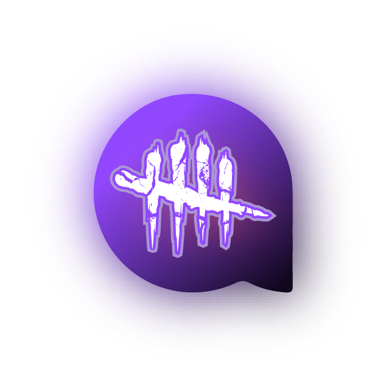
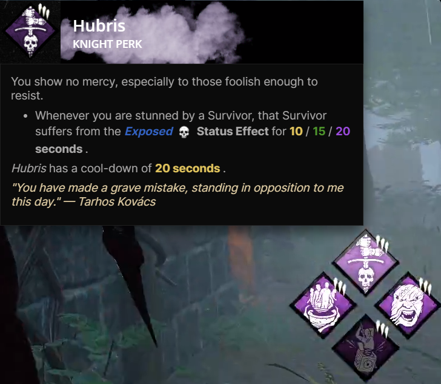

<a href="https://dashboard.twitch.tv/extensions/0ixgrf6sebd7d7sesoo762sq9rie81">Install on Twitch</a>
·
<a href="https://dbdtwitch.com">Official website</a>
·
<a href="https://discord.gg/b8R7P3fK">Discord</a>

This is the client for the Dead by Daylight Tooltips Twitch extension, which can be found here. It serves as a game overlay tailored for [Dead by Daylight](https://store.steampowered.com/app/381210/Dead_by_Daylight/), allowing viewers to conveniently hover over the streamer's current perks and addons to quickly access relevant details, descriptions and changelogs.

<p align="center">

</p>

_This application is not affiliated with or endorsed by Dead by Daylight, Behaviour Interactive, or Twitch._

## Bug reports

For reporting bugs, we highly recommend joining our [Discord](https://discord.gg/QTmFrs9C) as the issue you encounter may or may not be directly related to this particular aspect of the project. Your participation and feedback are greatly appreciated. Thank you.

## Compile

To compile the source code, you simply need to have [Node.js](https://nodejs.org/en/download) installed on your system. Once installed, you can run the following command:

```bash
  git clone --recurse-submodules https://github.com/KiKoS0/dbd-tooltips.git && cd dbd-tooltips
  make clean dev
```
